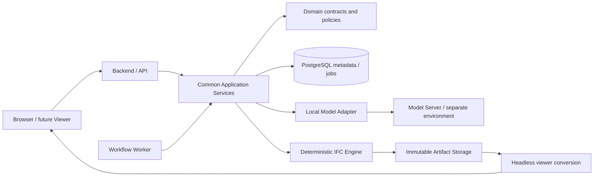
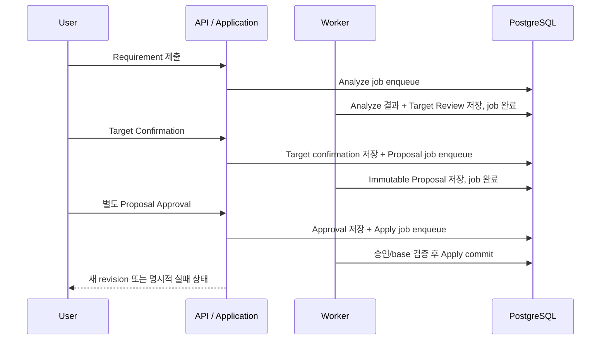

# NeuroBuild_v2 Architecture Blueprint

기준일: 2026-09-19. **설계 문서이며 Domain, DB schema, IFC Engine, Worker, API의 구현 또는 실행 검증 결과가 아니다.** 아래 상태명과 계약은 Phase 1에서 확정할 초안이다. 사용자 요구의 불변 조건은 그대로 유지한다.

## 1. 공통 Application과 프로세스 경계

초기 구조는 명시적인 Application Service를 사용하는 Modular Monolith다. 별도 배포 가능한 프로세스는 Backend/API, Workflow Worker, Local Model Server 정도로 한정한다. Domain은 HTTP, PostgreSQL driver, IfcOpenShell, GPU library를 직접 의존하지 않으며 Application이 Port를 통해 Infrastructure Adapter를 호출하는 방향으로 설계한다.



Domain, Application, Persistence, migration, IFC Engine, Requirement Pipeline, Object Resolver, jobs, API, frontend, schemas, prompts, tests는 양 서버 공통이다. 서버별 차이는 runtime dependency와 deployment configuration에서만 표현한다. 공통 Application은 physical GPU index나 GPU 모델명에 따라 제품 동작을 바꾸지 않는다.

| 모듈 | 책임 | 지켜야 할 경계 |
| --- | --- | --- |
| Domain | Requirement, target/proposal/revision 식별과 불변 조건, 명시 상태 전이 | LLM 출력이나 DB row를 그대로 신뢰하지 않음 |
| Application | analyze/resolve/propose/approve/apply orchestration | 대상 확인과 변경 승인을 분리; 실행은 검증된 Tool에 위임 |
| Model Adapter | local endpoint 호출, schema 형식 검증, 제한된 오류 처리 | raw IFC/DB/GPU 제어 권한 없음; 외부 API 자동 fallback 없음 |
| Object Resolver | base revision inventory 조회, 실제 후보 반환 | 존재하지 않는 GlobalId 생성 금지; 모호하면 사용자 선택 |
| IFC Engine | 지원 Placement 검증, XY move, invariant 검증 | 기존 full snapshot 변경 금지; 실행별 결과 파일 생성 |
| Persistence / Artifact Adapter | metadata transaction, immutable 파일, commit/recovery | DB BLOB에 IFC 저장 금지; DB/FS의 원자성을 가정하지 않음 |
| Job/Worker | durable job, lease, retry/idempotency, human review 재개 | human 대기 중 lease/worker 유지 금지 |
| Viewer Adapter | IFC → GLB + object metadata | 서버 GUI나 화면 출력에 의존하지 않음 |

LangChain/LangGraph, Redis/Celery, 범용 Agent framework는 초기 dependency에 포함하지 않는다. 명시적인 서비스 호출로 표현하기 어려운 실제 복잡성이 나타날 때 검토한다.

## 2. 저장소와 설정 경계

현재 Phase 0에서 실제로 준비하는 영역은 `docs/`, `configs/`, `scripts/`, `runtime/`, `requirements/`, `evaluations/`다. 다음 Application 배치는 **향후 구조**이며 이 문서 때문에 빈 구현이나 production dependency를 만들지 않는다.

```text
<project-root>/
  AGENTS.md
  README.md
  docs/
  configs/
    common.json
    a100.json
    rtx5090.json
  scripts/
    show_runtime_info.py
  requirements/
    README.md
  runtime/
    a100/README.md
    rtx5090/README.md
  evaluations/
  # 아래는 해당 Phase에서 추가할 구조
  src/neurobuild/
    domain/
    application/
    infrastructure/
    api/
    worker/
  migrations/
  schemas/
  prompts/
  tests/
  frontend/
  # 아래는 Git에서 제외할 실행 데이터와 환경
  .conda/
  .conda-vllm/
  var/
    artifacts/
    staging/
    models/
    cache/
    logs/
```

기존 `NeuroBuild_v1/`과 중첩 `NeuroBuild_v2/`는 과거 자료다. 새 root Application이 이 디렉터리를 import하거나 실행하지 않는다. RTX 5090에서 root의 절대 경로가 달라도 동작하도록 runtime storage 등은 checkout root 또는 명시된 storage 설정에 대해 해석한다.

설정은 공통 default, profile, 환경변수 override의 책임을 구분한다. `NEUROBUILD_PROFILE`은 profile을 선택하고 `PUBLIC_BASE_URL`, `FRONTEND_BASE_URL`, `API_BASE_URL`, `MODEL_SERVER_URL`은 접속 주소를 표현한다. Git에는 non-secret 예제만 저장하고 local 설정/secret은 제외한다. GPU 허용 정책은 URL 같은 일반 설정과 달리 임의 override로 다른 GPU를 허용할 수 없다.

A100 profile은 physical GPU 3, RTX 5090 profile은 physical GPU 1만 노출한다. Runtime launcher 구현 시 허용 GPU와 `CUDA_VISIBLE_DEVICES`의 일치, TP=1, 실제 profile을 검증하고 잘못된 경우 실행하지 않는다. VRAM 전체 사용 허용은 `gpu_memory_utilization=1.0` 강제를 의미하지 않는다. weight, runtime overhead, KV cache, context, 동시성을 실측하여 margin을 정한다.

## 3. 초기 Operation 계약

`MOVE_FURNITURE`의 입력과 거절 이유를 먼저 계약으로 정의한다. 최초 지원 범위는 IFC4, 단일 실제 IfcFurniture, 같은 Storey의 상대 XY 이동이다. Z, rotation, scale, storey, GlobalId는 유지한다.

다음은 Phase 1/3에서 확정할 사항이다.

- XY가 어느 좌표계 기준인지와 IFC project unit → 내부 길이 단위 변환 규칙.
- 허용하는 Placement 유형과 nested placement 처리 범위. 미지원 placement는 추측하여 변환하지 않는다.
- 회전된 parent placement, mapped representation, invalid containment 등 지원/거절 사례.
- 허용 오차, finite numeric 값, 단위·방향 누락과 모호성의 표현.
- 이동 전후 object identity, orientation, storey, 비대상 object 보존을 검증하는 방법.

명시적으로 지원된 범위가 아니면 IFC를 수정하지 않는다. 향후 안전성/설계 적합성 도구가 구현되기 전에는 단순 이동 성공을 collision-free, 법규 준수, 구조 안전성의 판정으로 표시하지 않는다.

## 4. LLM, Inventory, Human Review

LLM 출력은 검증할 제안이다. JSON schema 통과만으로 의미적으로 유효하거나 승인된 명령이 되지 않는다. Requirement Pipeline이 원문 target description을 보존하고 단위·값·모호성·미지원 요청을 검증한다. Tool selection도 allowlist와 Domain 계약으로 확인한다.

GlobalId는 base revision에서 추출한 실제 Object Inventory를 통해서만 선택한다. LLM이 생성한 문자열을 object identity로 채택하지 않는다. Resolver는 실제 후보와 근거를 제공하고, 모호하거나 일치하지 않으면 clarification/rejection으로 멈춘다.

**Target Confirmation**은 “이 객체가 맞다”는 확인이다. 확인 결과는 project, base revision, review, 실제 GlobalId에 묶인다. **Proposal Approval**은 “이 구체적인 변경을 적용해도 된다”는 별도의 승인이다. 승인은 proposal ID/내용 hash, base revision, target, operation parameters, 승인 주체/시각에 묶이는 방향으로 설계한다. Proposal 내용 변경은 기존 승인을 무효화한다. target 확인을 Apply 승인으로 재사용하지 않는다.

Human review 대기 중에는 Worker를 종료한다.



도식의 DB 기록과 enqueue는 각각 가능한 동일 DB transaction으로 묶는다. Workflow와 durable queue가 아직 없는 초기 Phase에서는 같은 서비스 경계를 동기 호출로 검증할 수 있으나 승인 생략으로 대체하지 않는다.

## 5. 명시 상태와 재시도

다음은 도메인 계약을 논의하기 위한 **상태명 초안**이다. DB schema 확정이나 구현 완료를 의미하지 않는다.

| 흐름 | 정상 전이 | 별도로 표현할 종료/대기 |
| --- | --- | --- |
| Analyze | submitted → analyzing → awaiting_target_confirmation | needs_clarification, unsupported, failed |
| Target Review | pending → confirmed | rejected, stale |
| Proposal | proposed → approved → applying → applied | rejected, stale, failed |
| Job | queued → running → succeeded | retryable_failed, terminal_failed, cancelled |
| Execution | prepared → artifact_finalized → committed | failed, recovery_required |

상태 전이는 Application Service가 검증한다. 임의 status 수정이나 API 요청 하나로 승인 단계를 건너뛰지 않는다. 실제 상태/이벤트 조합과 재시도 허용 전이는 Phase 1에서 확정한다. 예를 들어 human review가 pending인 동안 그 Analyze job은 이미 succeeded이며 running job으로 유지하지 않는다.

Phase 7의 PostgreSQL queue는 lease/heartbeat와 제한된 retry를 갖는 방향으로 설계한다. claim 동시성은 row locking 등으로 처리하지만 queue의 전달을 exactly-once로 가정하지 않는다. 중복 delivery 또는 Worker crash에 대비해 execution/idempotency key와 DB unique constraint로 **동일 Apply의 중복 revision 생성과 head 변경을 방지**한다. lease를 잃은 Worker는 commit 권한을 다시 검증해야 한다.

사용자 승인 기록은 내구성 있게 저장하고 복구 후에도 별도 검증한다. 실패나 retry가 새 승인으로 간주되지 않는다. 이미 commit된 execution을 재요청하면 기존 결과를 반환한다. 승인 자체가 변경된 proposal이나 다른 base revision에 자동으로 확장되지 않는다.

## 6. Revision과 동시 변경

Project는 `head_revision`을 가진다. Revision은 immutable full IFC snapshot과 parent/base 관계를 가지며 finalized artifact를 참조한다. Proposal은 특정 base revision에 묶이고 그 revision의 target inventory로만 해석한다.

Apply는 최소한 실행 시작 시와 최종 DB commit 시 현재 head가 proposal base와 같은지 확인한다. 최종 검증은 transaction 안에서 project row lock 또는 compare-and-swap으로 수행하며 revision 생성과 head 갱신을 함께 commit한다. 시작 때 검사만 하고 파일 생성 후 무조건 head를 바꾸면 concurrent Apply를 막을 수 없다.

- 두 proposal이 같은 base에서 시작해도 먼저 commit한 하나만 head를 변경한다.
- 이후 head가 바뀐 proposal은 stale로 표시한다. 자동 rebase, 새 대상 추측, 승인 재활용을 하지 않는다.
- stale proposal은 새 head에서 분석/검증하고 필요한 target 확인과 proposal 승인을 다시 받는다.
- 취소 또는 실패한 execution은 기존 head/IFC를 변경하지 않는다.
- 기존 Revision을 수정하거나 같은 artifact path에 새 IFC를 덮어쓰지 않는다.

## 7. Artifact Commit Protocol 설계

DB와 filesystem에는 공통 transaction이 없다. **파일의 durable finalize를 먼저 수행하고, 그 파일을 참조하는 Revision과 head를 DB transaction에서 commit**하는 순서를 기본안으로 한다. 이 설계는 Phase 2에서 crash/retry 테스트로 검증할 대상이다.

1. **Execution 준비:** idempotency key, project/base/proposal/approval을 검증하고 실행 intent를 durable하게 기록한다. 이미 commit된 실행이면 기존 결과를 반환한다. 실행별 staging 경로는 final artifact와 같은 filesystem에 두는 것이 기본이다.
2. **새 snapshot 작성:** 원본 artifact를 read-only 입력으로 사용한다. 실행별 staging에서 deterministic tool이 새 full IFC를 만들고 지원 범위·schema·불변 조건을 검증한다. 실패한 결과를 head에 연결하지 않는다.
3. **Finalize:** 파일 크기와 content hash를 계산하고 파일 및 필요한 directory metadata를 flush/fsync한다. 고유 immutable artifact ID로, 기존 파일을 덮어쓰지 않는 finalize primitive를 사용한다. 일반 `rename`이 기존 목적지를 교체할 수 있다는 점까지 구현에서 처리한다. 서로 다른 filesystem 사이 copy를 원자적 rename으로 간주하지 않는다.
4. **DB commit:** 하나의 PostgreSQL transaction에서 execution/approval의 유효성, lease 또는 fencing 조건, 현재 head=base를 다시 확인한다. finalized 파일 metadata 확인 후 Revision, artifact 참조, Execution 결과, head 갱신, 대응 job 완료를 함께 기록한다. 이 transaction 전에는 새 artifact를 current revision으로 노출하지 않는다.
5. **결과 공개:** commit한 revision ID를 응답한다. 동일 execution의 retry는 DB에서 같은 결과를 찾는다. DB commit 여부가 불확실하면 상태를 조회하여 확인하고 새 head 변경을 임의 반복하지 않는다.

| 중단 시점 | DB/head 상태 | 복구 방향 |
| --- | --- | --- |
| staging 작성 중 실패 | 기존 head 유지 | 실행 intent와 lease를 확인하고 재시도 또는 오래된 staging 정리 |
| finalize 성공, DB commit 전 crash | 기존 head 유지, finalized orphan 가능 | execution/base/approval를 다시 검증한 뒤 재사용하거나 orphan으로 보존·정리 |
| 최종 head 비교에서 stale | 기존 head 유지 | stale 기록; 미참조 artifact는 보존기간 후 정리 후보 |
| DB commit 성공, 응답 전 crash | 새 revision/head가 durable | idempotency key로 기존 commit 결과 반환 |
| committed artifact가 사라지거나 hash 불일치 | 정상 처리 불가 | 오류를 드러내고 복구; 성공으로 위장하거나 기존 path에 다른 내용 덮어쓰기 금지 |

정리는 committed 참조, 진행 중 intent, lease, 보존기간을 확인한 뒤 수행한다. DB 접속 불가 등으로 참조 여부를 판별할 수 없으면 파일을 삭제하지 않는다. 참조된 finalized artifact는 일반 cache 정리 대상이 아니다. 단순히 “DB에 아직 없으므로 삭제”하는 로직은 finalize와 commit 사이의 정상 실행을 파괴할 수 있다.

Artifact metadata에는 식별자, storage location, hash, size, media type, 생성 execution 등 복구에 필요한 정보를 남기는 방향이다. 실제 필드·transaction isolation·durability·보존기간·백업 방식은 Phase 1/2에서 정한다. Local filesystem으로 시작하되 Object Storage Adapter를 추가해도 공통 Application 계약과 immutable 성질은 유지한다.

## 8. Headless Viewer, Network, Runtime Info

Viewer는 IFC 수정 엔진의 일부가 아니다. 향후 server-side conversion이 revision별 GLB와 GlobalId/object mapping metadata를 만들고 브라우저가 Three.js/WebGL로 렌더링한다. 파생 viewer artifact는 원본 revision/hash에 묶어 stale cache를 구분한다. 변환 실패가 유효한 IFC revision 자체를 손상시키지 않는다.

서버에서 monitor/X/GUI/interactive window를 요구하지 않는다. 서버 렌더링이 필요해지는 경우 EGL/headless 지원을 별도로 확인한다. 이번 단계에는 화면 출력이나 conversion dependency를 설치하지 않는다.

Runtime Info는 profile, hostname, 설정상 GPU/physical index, frontend/API/model URL, model ID, Git commit, 증거 수준을 표시하는 관리 기반이다. `scripts/show_runtime_info.py`의 설정 출력은 endpoint health, GPU 할당 또는 모델 실행 성공의 증명이 아니다. 없는 값은 미설정/미검증으로 표시하고 추측한 실측값을 출력하지 않는다. 향후 Admin API가 같은 관리 정보를 재사용할 수 있다.

고정 Domain/Gateway는 장기 deployment concern이다. A100/RTX 5090 전환 전에 source 버전뿐 아니라 DB migration, revision, artifacts, 사용자 데이터의 일관성이 필요하다. Phase 0은 gateway, active-active 운영, 자동 failover를 구축하지 않는다.

## 9. 관측성과 검증

장기적으로 `trace_id`, `project_id`, `job_id`, `proposal_id`, `revision_id`, `execution_id`를 연결한다. 사용자에게는 오류 code와 필요한 조치를 보여주고 내부 stack trace를 노출하지 않는다. 운영 로그에 secret이나 chain-of-thought를 저장하지 않는다. 판단의 감사 기록은 구조화된 결과와 짧은 근거, 승인 및 실행 이력으로 남긴다.

후속 기능 검증은 실제 실패 위험에 맞춘다.

- Domain: 지원/미지원 범위, 단위·모호성, 승인 두 종류의 분리, stale 상태 전이.
- IFC: 단일 대상 XY 변경과 Z/orientation/scale/storey/GlobalId/비대상 객체 보존.
- Persistence: concurrent head update, idempotency, crash 시점별 Artifact Commit Protocol, 복구/정리 경쟁.
- Workflow: human 대기 중 job 종료, 별도 승인 후 재개, 실패·중복 delivery·lease 만료.
- Model: schema validity 외 semantic correctness, target 보존, critical false positive/negative, ambiguity/unsupported detection.
- Cross-server: 동일 commit과 Application dependency로 공통 contract tests; runtime은 각 서버에서 별도 compatibility validation.

RTX 5090에서 위 검증이 수행되기 전에는 해당 결과를 PASS로 기록하지 않는다. A100에도 dependency를 설치하지 않은 Phase 0에서는 Application/IFC/DB/Model 기능 테스트가 아직 없음을 명확히 한다.
